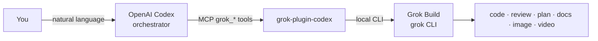
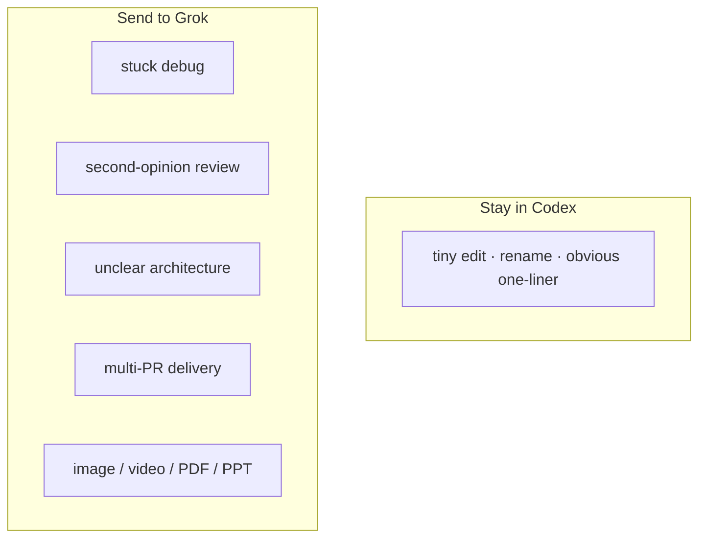
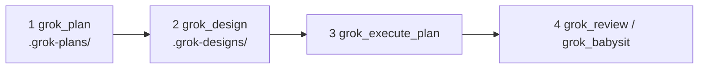

# grok-plugin-codex

[中文](./README.md) | **English**

A Codex plugin to use Grok inside OpenAI Codex.  
Stay in [Codex](https://github.com/openai/codex). Hand hard work to local [Grok Build](https://grok.com): code review, delegated coding, planning, design docs, PR babysitting, PDF/PPT, images, and short video.

| | |
|---|---|
| **English search terms** | Codex Grok plugin · use Grok in Codex · Grok MCP for Codex · Grok Build Codex · delegate Codex tasks to Grok |
| **中文检索词** | Codex 调用 Grok · 在 Codex 上用 Grok · Codex Grok 插件 · OpenAI Codex 用 xAI Grok · Codex MCP Grok |

Not an official xAI or OpenAI product. Version **0.6.0**. Apache-2.0. Derivative of [`stdevMac/grok-in-codex`](https://github.com/stdevMac/grok-in-codex).

---

## What it is

Codex stays the **orchestrator** (you talk to it, it splits work, it watches jobs).  
This repo is a **thin MCP plugin**: it does not replace Codex and it is not a Grok fork. It shells out to the `grok` CLI already installed on your machine.



**Use this when** you want a second agent inside Codex, a structured review before merge, a plan → design → implement pipeline, or Grok’s image/video/docs (Codex does not have those).  
**Skip it when** you only need one-line fixes, renames, or chat that never touches the repo.



---

## What you can do

| You want | Ask Codex | Tool |
|---|---|---|
| Fix or investigate | “Have Grok investigate why tests fail” | `grok_rescue` |
| Plan only, no edits | “Use Grok to plan the auth rewrite” | `grok_plan` |
| Design doc + PR split | “Generate a design doc with Grok” | `grok_design` |
| Implement that design | “Execute the latest Grok plan, dry-run first” | `grok_execute_plan` |
| Review a branch / PR | “Ask Grok to review this branch against main” | `grok_review` |
| Challenge assumptions | “Adversarial review the billing design” | `grok_adversarial_review` |
| Watch CI / review comments | “Babysit open PRs with Grok” | `grok_babysit` |
| Named multi-agent recipe | “List / run a Grok workflow” | `grok_workflow` |
| PDF / Word / PPT | “One-pager PDF for the launch” | `grok_document` |
| Image / short video | “16:9 launch banner with Grok” | `grok_image` / `grok_video` |
| Job board | “Show Grok job status” | `grok_status` / `grok_result` / `grok_cancel` |

Larger product work should not be one giant rescue:



Artifacts land in the project (gitignore these): `.grok-plans/` `.grok-designs/` `.grok-reviews/` `.grok-docs/` `.grok-media/` `.grok-workflows/`.

---

## Requirements

- Node.js **18.18+**
- [Grok Build CLI](https://grok.com) (`grok`) on `PATH`, typically `~/.grok/bin/grok`
- `grok login`
- Grok Build **≥ 1.0.5 recommended** (0.2.118 still launches; flags are capability-gated)
- `gh` only for PR review posting

This plugin does not ship a model and does not log you into Grok.

---

## Install

```bash
codex plugin marketplace add /path/to/grok-plugin-codex/.agents/plugins
codex plugin add grok@grok-plugin-codex
```

Start a **new** Codex thread so MCP tools load. Then:

```bash
node plugins/grok/scripts/grok-companion.mjs setup
```

or ask Codex to call `grok_setup`.

Codex may start the plugin from its install cache. Pass the real project path as `cwd` on every tool call so jobs and artifacts stay in that repo:

```text
grok_review cwd="/path/to/project" base=main
grok_status cwd="/path/to/project" json=true
```

---

## Quick start

Say this in Codex:

```text
Ask Grok to review this branch against main.
Use Grok to plan the auth rewrite.
Generate a design doc with Grok, then execute the latest plan dry-run.
Start a background Grok rescue job for the retry redesign.
Generate a 16:9 launch banner with Grok.
Show Grok job status.
```

MCP examples:

```text
grok_plan prompt="plan the auth rewrite" background=true
grok_design prompt="design multi-tenant billing" background=true
grok_execute_plan latest=true dryRun=true
grok_workflow action=list
grok_review base=main focus="auth, data loss, and race conditions"
grok_rescue prompt="investigate why npm test is failing" background=true
grok_babysit action=list
grok_document type=pdf prompt="one-pager for the launch"
grok_image aspect="16:9" prompt="Dark developer-tool launch banner"
grok_video image="./.grok-media/image/hero.png" duration="6" prompt="gentle camera push-in"
grok_status
grok_result jobId="plan-abc123"
```

---

## Tools

| Tool | Purpose |
|---|---|
| `grok_setup` | CLI + auth + version + doctor; optional stop-review gate |
| `grok_rescue` | Investigation / implementation (write by default) |
| `grok_plan` | Plan mode only → `.grok-plans/` |
| `grok_review` | Read-only review (tree / branch / PR; optional `postPending`) |
| `grok_adversarial_review` | Challenge design and assumptions |
| `grok_workflow` | List/run Grok Rhai workflows |
| `grok_design` | Design doc + PR plan → `.grok-designs/` |
| `grok_execute_plan` | Execute a design-doc PR DAG |
| `grok_babysit` | Watch PRs / fix CI & review comments (`list` is read-only) |
| `grok_document` | docx / pdf / pptx → `.grok-docs/` |
| `grok_image` | Generate or edit images → `.grok-media/image/` |
| `grok_video` | Short videos → `.grok-media/video/` |
| `grok_sessions` | List / search / export Grok sessions |
| `grok_transfer` | Context-transfer notes for Grok |
| `grok_status` | Jobs + live progress / log tail + usage |
| `grok_result` | Final output (plan.md preferred for plan jobs) |
| `grok_cancel` | Cancel a background job |

**Control flags** on long jobs: `sandbox` (`workspace`, `read-only`, `strict`, `devbox`, `off`; stale alias `workspace-write` → `workspace`), `planMode` / `permissionMode`, `agent`, `noSubagents`, `memory` / `noMemory`, `allow` / `deny`, `disableWebSearch`, `forkSession`, `maxTurns`.

Aligned with **Grok CLI 1.0.x**: `--check` and `--best-of-n` are not forwarded when the CLI lacks them. `check=true` is injected into the prompt instead. Write jobs that only think/read for many turns are stopped as execution drift.

---

## Usage notes

**Rescue** — write-capable by default. `readOnly=true` to investigate only. `worktree=true` for safer edits.

**Plan / design / execute** — harvest into `.grok-plans/` and `.grok-designs/`. `latest=true` picks the newest design. `dryRun=true` is read-only.

**Review** — never applies patches. `postPending=true` + a PR posts PENDING GitHub comments when there are findings.

**Media** — files are copied into `.grok-media/` so the project path contract holds.

**Jobs** — `background=true` returns a job id. Multiple Grok jobs may run at once. Track with `grok_status` / `grok_result` / `grok_cancel`.

**CLI posture** — denylist (`--disallowed-tools`) over allowlist. Media and dry-run / validate-only / babysit `list` are read-only (no yolo). Reviews default to `--sandbox read-only` and do not strip the shell tool (Grok 1.0.x needs it for task output).

### Environment

| Variable | Purpose |
|---|---|
| `GROK_BINARY` | Override `grok` path (tests use a mock) |
| `GROK_CODEX_PLUGIN_STATE` | Job-state root for this plugin |
| `CODEX_PLUGIN_DATA` | Host plugin data dir; trusted only when basename is `grok` / `grok-*` |

Default state: `~/.grok/codex-plugin/state/`. Not shared with Claude plugin state.

### Job control

- No global single-job lock. Prefer `background=true` for long work.
- Status tails text **and** thought streams; whitespace-only tokens stay `running`. Status also records last tool / whether a write tool ran.
- Plan results prefer harvested `plan.md`. Finished jobs store `config`, `usage`, `artifacts` (v3).
- Reaper: dead pid + complete `result.json` → completed; dead pid + truncated result → **failed** (no forever-running zombies).
- Background `result.json` is written atomically (tmp + rename).
- PR post-pending also runs on background completion; empty/oversize diffs fail closed and save findings under `.grok-reviews/`.

---

## Development

```bash
npm test
node plugins/grok/scripts/grok-companion.mjs setup --json
node plugins/grok/mcp/server.mjs   # stdio NDJSON MCP server
```

Keep the same version string in `package.json`, `plugins/grok/.codex-plugin/plugin.json`, and `.agents/plugins/marketplace.json`.

---

## License

Apache-2.0. See `LICENSE` and `NOTICE`.

This project is a derivative of [stdevMac/grok-in-codex](https://github.com/stdevMac/grok-in-codex) by [stdevMac](https://github.com/stdevMac).
