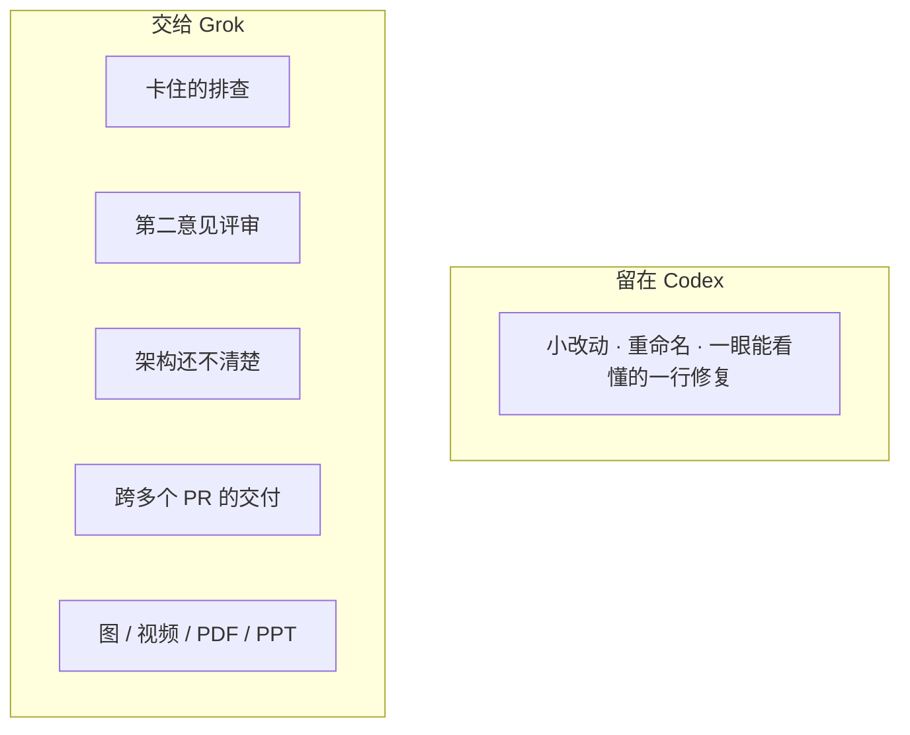
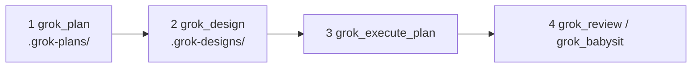

# grok-plugin-codex

**中文** | [English](./README.en.md)

在 [Codex](https://github.com/openai/codex) 里直接用 Grok 的插件。  
人还是跟 Codex 说话。评审、修硬 bug、出方案、写设计、盯 PR、出文档 / 图 / 视频，交给本机 [Grok Build](https://grok.com)。

| | |
|---|---|
| **中文检索词** | Codex 调用 Grok · 在 Codex 上用 Grok · Codex Grok 插件 · OpenAI Codex 用 xAI Grok · Codex MCP Grok |
| **English search terms** | Codex Grok plugin · use Grok in Codex · Grok MCP for Codex · Grok Build Codex · delegate Codex tasks to Grok |

非 xAI / OpenAI 官方产品。当前版本 **0.6.0**。Apache-2.0。衍生自 [`stdevMac/grok-in-codex`](https://github.com/stdevMac/grok-in-codex)。

---

## 这是什么

Codex 继续当工头：你跟它说话，它拆任务、盯进度。  
本仓库只是一层很薄的 MCP 插件，不会替换 Codex，也不是把 Grok 模型嵌进 Codex。它调用的是你本机已经装好的 `grok` CLI。


**适合：** 想在 Codex 里再加一个能干活的第二智能体；合并前要一份结构化评审；走「方案 → 设计 → 落地」；或者要用 Grok 的图 / 视频 / 文档能力（Codex 本身没有这些）。  
**不必用：** 一行就能改完的修复、重命名、或者根本不碰仓库的闲聊。



---

## 能做什么

| 你想 | 对 Codex 说 | 工具 |
|---|---|---|
| 修问题 / 排查 | 「让 Grok 查一下测试为什么失败」 | `grok_rescue` |
| 只出方案，不改代码 | 「用 Grok 规划一次鉴权重写」 | `grok_plan` |
| 设计文档 + PR 拆分 | 「让 Grok 出一份设计文档」 | `grok_design` |
| 按设计落地 | 「执行最新的 Grok 方案，先 dry-run」 | `grok_execute_plan` |
| 评审分支 / PR | 「让 Grok 对照 main 评审这个分支」 | `grok_review` |
| 挑战前提 | 「对计费设计做对抗式评审」 | `grok_adversarial_review` |
| 盯 CI / Review 评论 | 「让 Grok 盯着打开的 PR」 | `grok_babysit` |
| 命名工作流 | 「列出 / 跑一个 Grok workflow」 | `grok_workflow` |
| PDF / Word / PPT | 「做一页发布用 PDF」 | `grok_document` |
| 图 / 短视频 | 「用 Grok 做一张 16:9 发布 banner」 | `grok_image` / `grok_video` |
| 任务看板 | 「看看 Grok 任务状态」 | `grok_status` / `grok_result` / `grok_cancel` |

更大的产品工作不要塞进一次巨型 rescue：



产物会落到项目目录里（建议 gitignore）：`.grok-plans/` `.grok-designs/` `.grok-reviews/` `.grok-docs/` `.grok-media/` `.grok-workflows/`。

---

## 环境

- Node.js **18.18+**
- [Grok Build CLI](https://grok.com)（`grok`）在 `PATH` 上，常见路径是 `~/.grok/bin/grok`
- `grok login`
- 建议 Grok Build **≥ 1.0.5**（0.2.118 仍能启动；具体 flag 按能力探测开关）
- 只有要往 PR 上发评论时才需要 `gh`

这个插件不自带模型，也不会替你登录 Grok。

---

## 安装

```bash
codex plugin marketplace add /path/to/grok-plugin-codex/.agents/plugins
codex plugin add grok@grok-plugin-codex
```

开一个**新的** Codex 会话，MCP 工具才会加载。然后：

```bash
node plugins/grok/scripts/grok-companion.mjs setup
```

或者让 Codex 调用 `grok_setup`。

Codex 可能会从安装缓存启动插件。每次调用工具时把真实项目路径传给 `cwd`，任务和产物才会落在那个仓库：

```text
grok_review cwd="/path/to/project" base=main
grok_status cwd="/path/to/project" json=true
```

---

## 上手

在 Codex 里直接说：

```text
让 Grok 对照 main 评审这个分支。
用 Grok 规划一次鉴权重写。
让 Grok 出一份设计文档，然后 dry-run 执行最新方案。
给重试重构开一个后台 Grok rescue。
用 Grok 生成一张 16:9 发布 banner。
看看 Grok 任务状态。
```

MCP 示例：

```text
grok_plan prompt="plan the auth rewrite" background=true
grok_design prompt="design multi-tenant billing" background=true
grok_execute_plan latest=true dryRun=true
grok_workflow action=list
grok_review base=main focus="auth, data loss, and race conditions"
grok_rescue prompt="investigate why npm test is failing" background=true
grok_babysit action=list
grok_document type=pdf prompt="one-pager for the launch"
grok_image aspect="16:9" prompt="Dark developer-tool launch banner"
grok_video image="./.grok-media/image/hero.png" duration="6" prompt="gentle camera push-in"
grok_status
grok_result jobId="plan-abc123"
```

---

## 工具一览

| 工具 | 用途 |
|---|---|
| `grok_setup` | CLI + 登录 + 版本 + doctor；可选 stop-review 门槛 |
| `grok_rescue` | 排查 / 落地（默认可写） |
| `grok_plan` | 只做方案 → `.grok-plans/` |
| `grok_review` | 只读评审（tree / 分支 / PR；可选 `postPending`） |
| `grok_adversarial_review` | 挑战设计和前提 |
| `grok_workflow` | 列出 / 运行 Grok Rhai workflow |
| `grok_design` | 设计文档 + PR 计划 → `.grok-designs/` |
| `grok_execute_plan` | 执行设计文档里的 PR DAG |
| `grok_babysit` | 盯 PR / 修 CI 和 review 评论（`list` 是只读） |
| `grok_document` | docx / pdf / pptx → `.grok-docs/` |
| `grok_image` | 生成或编辑图片 → `.grok-media/image/` |
| `grok_video` | 短视频 → `.grok-media/video/` |
| `grok_sessions` | 列出 / 搜索 / 导出 Grok 会话 |
| `grok_transfer` | 给 Grok 的上下文交接笔记 |
| `grok_status` | 任务 + 实时进度 / 日志尾巴 + 用量 |
| `grok_result` | 最终输出（plan 任务优先 `plan.md`） |
| `grok_cancel` | 取消后台任务 |

长任务的**控制参数**：`sandbox`（`workspace`、`read-only`、`strict`、`devbox`、`off`；旧别名 `workspace-write` 会归一成 `workspace`），`planMode` / `permissionMode`，`agent`，`noSubagents`，`memory` / `noMemory`，`allow` / `deny`，`disableWebSearch`，`forkSession`，`maxTurns`。

对齐 **Grok CLI 1.0.x**：CLI 没有 `--check` / `--best-of-n` 时不会硬传。`check=true` 会写进 prompt。只想/只读很多轮却不写文件的写任务，会按执行漂移停掉。

---

## 用法要点

**Rescue** — 默认可写。`readOnly=true` 只排查。`worktree=true` 改得更安全。

**Plan / design / execute** — 产物收到 `.grok-plans/` 和 `.grok-designs/`。`latest=true` 选最新设计。`dryRun=true` 是只读。

**Review** — 永远不打补丁。`postPending=true` 加上 PR 后，有发现才会发 PENDING GitHub 评论。

**Media** — 文件会拷进 `.grok-media/`，保证还在项目路径契约里。

**Jobs** — `background=true` 会返回 job id。多个 Grok 任务可以同时跑。用 `grok_status` / `grok_result` / `grok_cancel` 跟踪。

**CLI 姿态** — 用 denylist（`--disallowed-tools`）而不是 allowlist。媒体、dry-run / validate-only、babysit `list` 都是只读（不加 yolo）。评审默认 `--sandbox read-only`，不会摘掉 shell 工具（Grok 1.0.x 产出任务结果需要它）。

### 环境变量

| 变量 | 用途 |
|---|---|
| `GROK_BINARY` | 覆盖 `grok` 路径（测试会用 mock） |
| `GROK_CODEX_PLUGIN_STATE` | 本插件的任务状态根目录 |
| `CODEX_PLUGIN_DATA` | 宿主插件数据目录；只有 basename 是 `grok` / `grok-*` 时才信任 |

默认状态目录：`~/.grok/codex-plugin/state/`。不和 Claude 插件状态共用。

### 任务控制

- 没有全局单任务锁。长任务优先 `background=true`。
- 状态会跟文本流和 thought 流；只有空白 token 时仍显示 `running`。状态还会记录最近一次工具、以及有没有跑过写工具。
- Plan 结果优先收割 `plan.md`。完成的任务会存 `config`、`usage`、`artifacts`（v3）。
- Reaper：pid 已死且 `result.json` 完整 → completed；pid 已死但结果被截断 → **failed**（不会永远卡在 running）。
- 后台 `result.json` 是原子写入（tmp + rename）。
- PR post-pending 在后台完成时也会跑；空 diff / 过大 diff 会 fail closed，发现写到 `.grok-reviews/`。

---

## 开发

```bash
npm test
node plugins/grok/scripts/grok-companion.mjs setup --json
node plugins/grok/mcp/server.mjs   # stdio NDJSON MCP server
```

`package.json`、`plugins/grok/.codex-plugin/plugin.json`、`.agents/plugins/marketplace.json` 里的版本号必须一致。

---

## 许可

Apache-2.0。见 `LICENSE` 和 `NOTICE`。

本项目衍生自 [stdevMac](https://github.com/stdevMac) 的 [stdevMac/grok-in-codex](https://github.com/stdevMac/grok-in-codex)。
